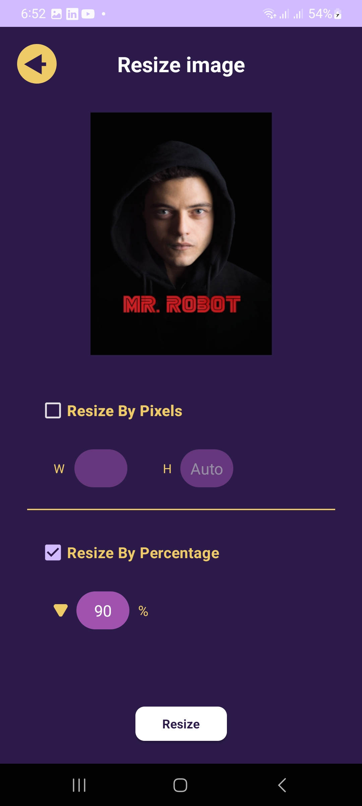

# Android Image Manipulation App (Kotlin)

A compact, offline-first image tools app for Android. It lets you crop, resize, compress, convert formats, and share images, then saves results to the device's MediaStore.

## Screenshots

  
  
  

## Features

* ✂️ **Crop** (free or 1:1) using CanHub Cropper with explicit Cancel/Done.
* 📐 **Resize** by pixels (width with optional height) or by percentage; aspect preserved when height omitted.
* 🗜️ **Compress** in Auto (target bytes via quality stepping) or Manual (quality 10–95).
* 🔄 **Convert** between JPEG, PNG, and WEBP (downsamples very large sources for stability).
* 💾 **Saves to Gallery** (MediaStore) with `ImgResizer_*.ext` filenames.
* 🗂️ **Recent Files** list filtered by app prefix; quick Share (WhatsApp intent) and Delete.
* 🧭 **EXIF-aware** dimension probing (handles rotated images correctly).
* ✅ **Modern Android**: Kotlin, ViewBinding, Activity Result APIs, coroutines, Glide.

## How it Works

1. User picks an image via `ActivityResultContracts.GetContent()`.
2. `MainActivity` routes to Cropper, Resize, Compress, or Format screens.
3. Bitmaps are decoded safely (Glide where appropriate).
4. Output is written to MediaStore and immediately visible in gallery apps.
5. Recent Files queries by `DISPLAY_NAME LIKE 'ImgResizer_%'` for a tidy history.

## Tech Stack

* Kotlin, ViewBinding
* Glide (bitmap decode/resize)
* CanHub Android-Image-Cropper
* AndroidX ExifInterface
* RecyclerView, Material Components

## Build & Run

1. Clone the repo and open in Android Studio.
2. Sync Gradle and Run on a device/emulator (API 23+ recommended).
3. No server or API keys required.

Uses Storage Access Framework + MediaStore. On newer Android versions, no broad write permission is needed.

## Permissions (by Android version)

* **Android 13+ (API 33+)**: `READ_MEDIA_IMAGES` (for Recent query)
* **Android 10–12**: `READ_EXTERNAL_STORAGE`
* **Pre-29**: `READ_EXTERNAL_STORAGE`, `WRITE_EXTERNAL_STORAGE`

## Notes

* Outputs are named `ImgResizer_<timestamp>.*`; the Recent list relies on this prefix.
* When sharing, a FileProvider authority like `${applicationId}.fileprovider` is used; grant temporary read permission on the intent.

## License

MIT License — see [LICENSE](LICENSE) for details.
